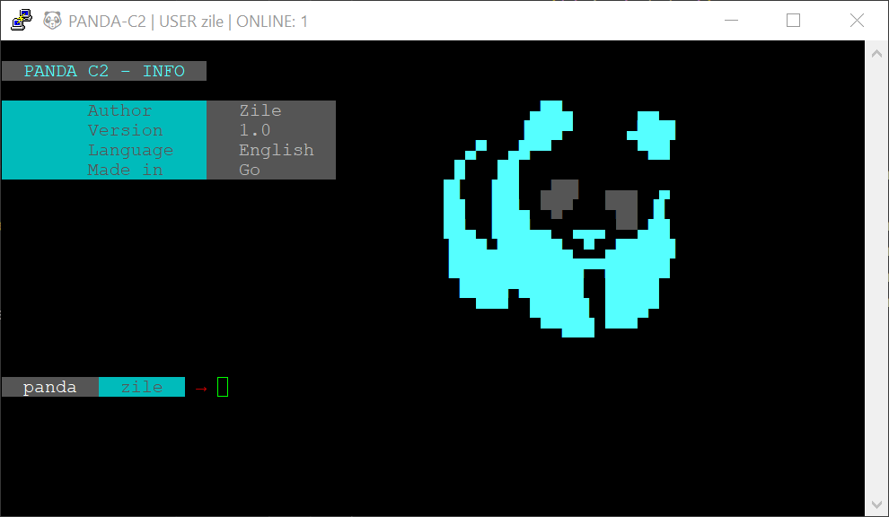
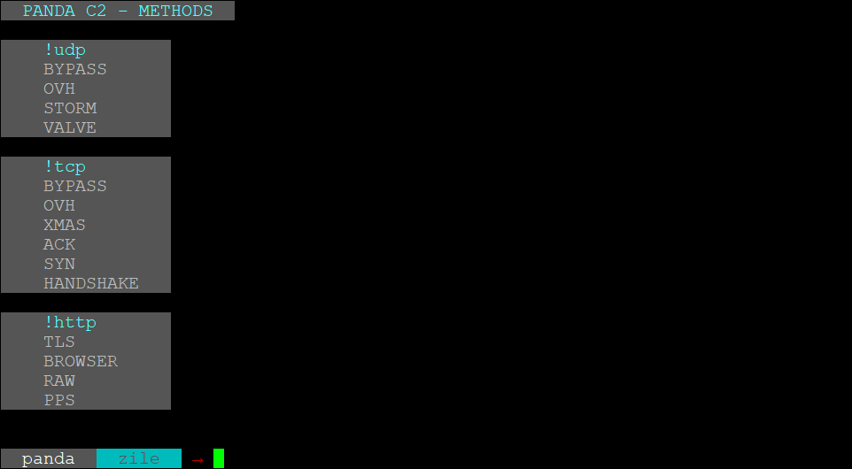
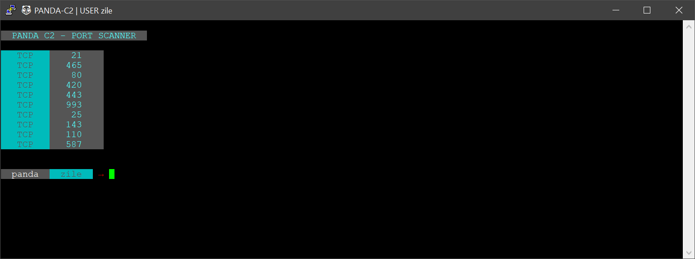

# panda-c2
#### Golang C2 Client + PHP API Handler
#### Custom design
#### PHP Handler for API
#### Golang Server Handler
```
go build -o c2
```
## Some Screens



## Disclaimer
This repository is for academic purposes, the use of this software is your responsibility.
